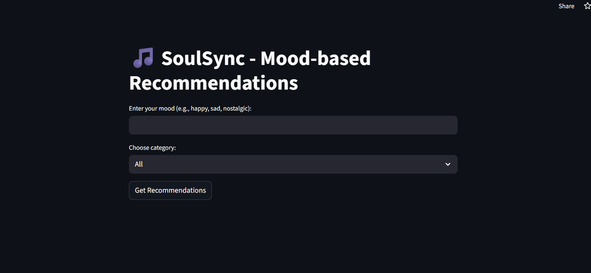
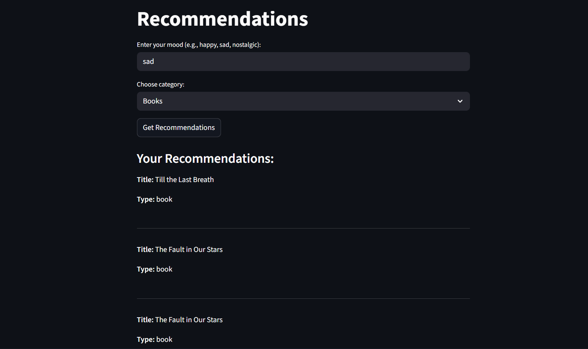

# 🎶 SoulSync - Mood-based Recommendation App

## Overview
SoulSync suggests **songs, movies, and books** based on your current mood.
Built with **Streamlit + Semantic Search (Sentence Transformers)**.

## Features
- Enter your mood (happy, sad, nostalgic, etc.)
- Choose category: Songs / Movies / Books / All
- Smart semantic search for better matching
- Clean Streamlit web app UI

## Tech Stack
- Python, Streamlit
- Pandas, Scikit-learn
- Sentence Transformers (semantic search)

## Live Demo
👉 [Try SoulSync here](https://soulsyncproject-2wine8h9vetsodxdfstez6.streamlit.app/)

## Screenshots

---
⭐ Built with love to bring nostalgia alive!
